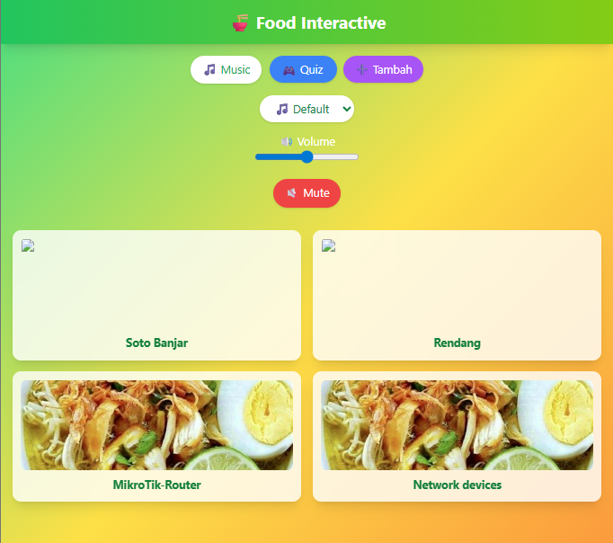
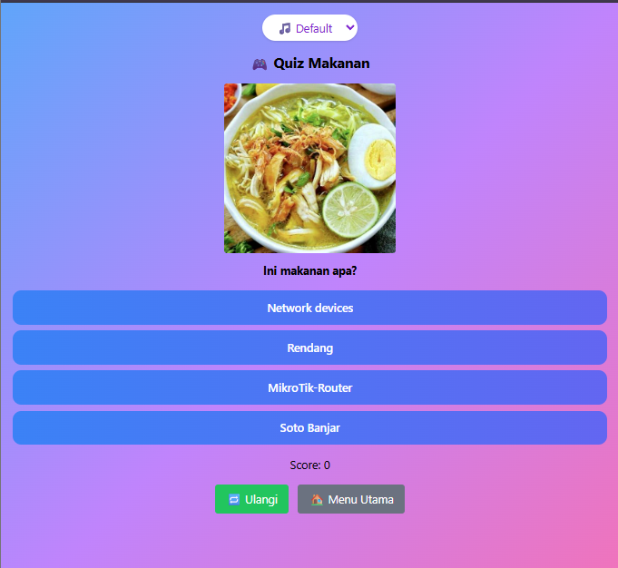

# 🍜 Food Interactive Website

Website multimedia interaktif berbasis web yang menampilkan berbagai makanan khas dengan fitur quiz dinamis, audio, dan interaksi pengguna.

---

## ✨ Fitur Utama

* 📌 **Daftar Makanan Interaktif**
  Menampilkan berbagai makanan dalam bentuk card yang bisa diklik untuk melihat detail (gambar + deskripsi)

* ➕ **Tambah Makanan (Dynamic Input)**
  User dapat menambahkan data makanan sendiri tanpa mengubah kode (menggunakan localStorage)

* 🎮 **Quiz Otomatis**
  Soal quiz dibuat secara dinamis dari data makanan yang tersedia

* 🔊 **Audio Interaktif**

  * Background Music (BGM)
  * Sound Effect (klik, benar, salah, selesai)

* 🎨 **UI Modern & Responsif**
  Menggunakan Tailwind CSS dengan animasi dan efek interaktif

---

## 🧠 Konsep Multimedia

Project ini mengimplementasikan konsep multimedia interaktif:

* Interaktivitas (klik, input user, quiz)
* Audio (musik & efek suara)
* Visual (gambar makanan)
* Feedback (score & respon jawaban)

---

## 🛠️ Teknologi yang Digunakan

* HTML5
* CSS3 (Tailwind CSS)
* JavaScript (Vanilla JS)
* LocalStorage (penyimpanan data)
* Git & GitHub (version control)

---

## 📁 Struktur Project

```food-interactive/
├── index.html
├── README.md
│
├── pages/
│   ├── quiz.html
│   ├── add.html
│
├── assets/
│   ├── js/
│   │   ├── app.js        # tampilkan makanan + modal
│   │   ├── quiz.js       # quiz dinamis
│   │   ├── audio.js      # BGM & SFX
│   │
│   ├── data/
│   │   └── foods.json    # data awal makanan
│   │
│   ├── images/
│   │   └── foods/        # gambar makanan
│   │
│   ├── audio/
│   │   ├── suara-background.mp3
│   │   ├── sbggame.mp3
│   │   ├── sbgdefault.mp3
│   │   ├── clicksound.mp3
│   │   ├── sfxbenar.mp3
│   │   ├── sfxsalah.mp3
│   │   └── selesai.mp3
│
└── .gitignore
```

---

## 🚀 Cara Menjalankan Project

1. Clone repository:

```bash
git clone https://github.com/kudaniii/allyoucaneat.git
```

2. Buka project di VS Code

3. Jalankan menggunakan:

* Live Server (disarankan)

4. Buka di browser:

```text
http://127.0.0.1:5500
```

```Atau langsung dari link ini :
https://kudaniii.github.io/allyoucaneat/
```

---

## 🧪 Cara Penggunaan

1. Buka halaman utama
2. Klik makanan untuk melihat detail
3. Klik **Quiz** untuk bermain
4. Klik **Tambah** untuk menambahkan makanan baru
5. Data akan tersimpan otomatis di browser

---

## 📸 Preview 

screenshot di sini:

```
preview/home.png
preview/quiz.png
```
Atau ini



---

## 🎯 Tujuan Project

Project ini dibuat untuk memenuhi tugas mata kuliah **Multimedia Interaktif**, dengan tujuan:

* Mengimplementasikan konsep interaktivitas dalam web
* Menggabungkan elemen multimedia (teks, gambar, audio)
* Membuat aplikasi berbasis user interaction

---

## ⚠️ Catatan

* Data tambahan disimpan di **localStorage**, bukan database
* Jika cache browser dihapus, data tambahan akan hilang
* Disarankan menggunakan browser modern (Chrome, Edge)

---

## 🚀 Pengembangan Selanjutnya

* 🔐 Login user (Firebase Auth)
* ☁️ Database online (Firestore)
* ❤️ Like & komentar
* 🖼️ Upload gambar langsung
* 🌐 Deploy ke GitHub Pages

---

## 👨‍💻 Author

* Nama: rahmadhani
* Universitas: STMIK PALANGKARAYA
* Program Studi: Teknik Informatika

---

## ⭐ Penutup

Project ini dikembangkan sebagai media pembelajaran sekaligus portfolio dalam pengembangan web interaktif berbasis multimedia.

---
